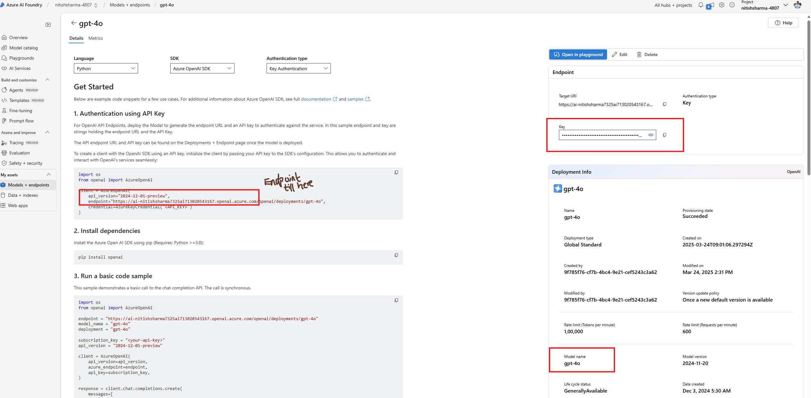
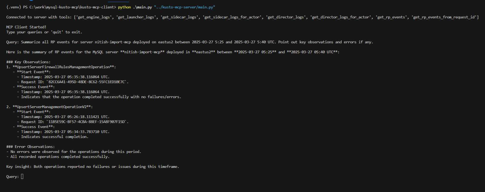

# 1. Background

This Chat app can answer kusto queries in conversational manner. In the backend, it uses the MCP Client/Server framework and AzureOpenAI's LLM.

## 2. Prerequisites

- Python
- pip
- Azure OpenAI's parameters

## 3. Setup environment

```bash
az login
```

Current code uses Az CLI authentication for connection to kusto, so perform the above step before running the app.

Clone the repo, activate virtual environment and install dependencies for client and server:

```bash
git clone <this repo>
virtualenv .venv
.venv/scripts/activate
pip install -r kusto-mcp-client/requirements.txt
pip install -r kusto-mcp-server/requirements.txt
cd kusto-mcp-client
```

- Create a .env file inside kusto-mcp-client directory and add the following variables:
- Go to the [Azure OpenAI Service](https://ai.azure.com/resource/overview) page in Azure AI Foundry portal.
- Find them as mentioned in the picture below:

```env
AZUREOPENAI_API_KEY       = ""
AZUREOPENAI_ENDPOINT      = ""
AZUREOPENAI_API_VERSION   = ""
AZUREOPENAI_MODEL         = ""
```



## 4. How to run sample project

From Inside kusto-mcp-client dir, run the below command:

```bash
python main.py "../kusto-mcp-server/main.py"
```

- Enter your queries in the terminal as show in this picture and start chatting



- To start a new session, enter quit and start the client again
